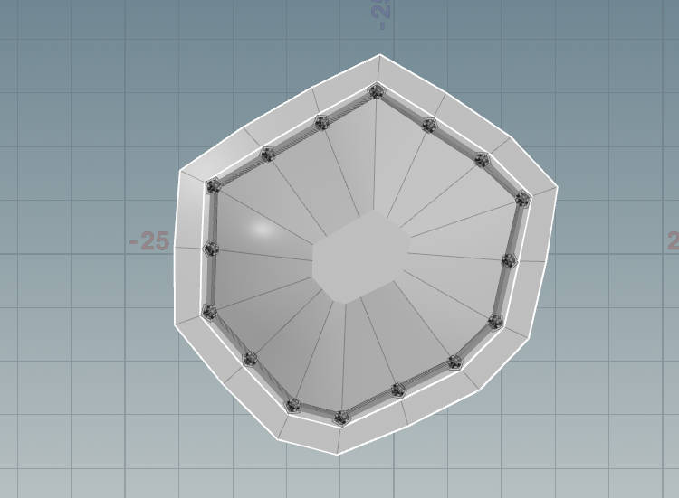
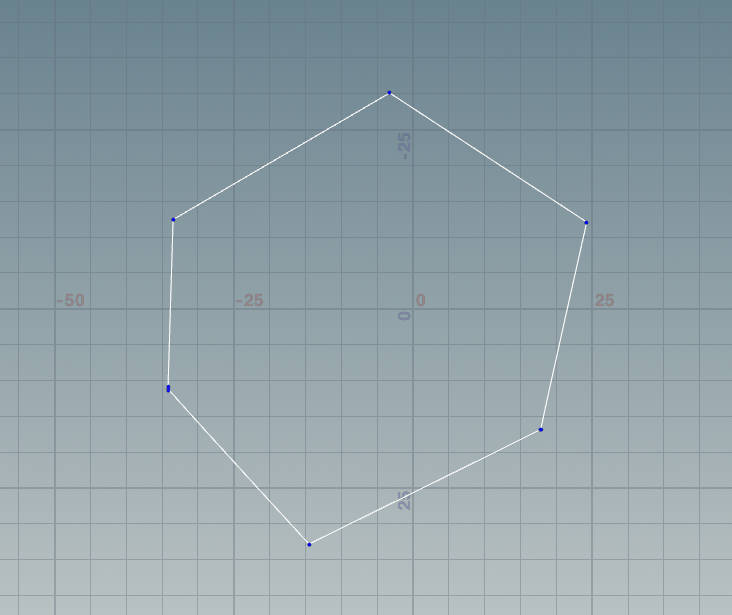

# Design Doc

## Goal
I want to continue detailing my gothic building, and create a cool interior environment for it.

## Inspiration/References:

## Specifications:
Some features I would like to recreate from the concept art:
- Procedural Staircase
- Vegetation (flowers, veins)
- butterfly flocking animation (if I have time)
- lighting scenario
- Book shelves
- (maybe) character statues
I also want to add in an idea I had from before. The building will be in 2 parts. Bottom floor is going to be bookshelves underneath the staircase. Then above it are the pretty windows.

## Techniques:
- Lot of procedural modeling
- curve based vegetation tool
- procedural flocking animation

## Design:
Seems quite straight forward so I don't think there's a need for diagrams.

# Milestone 1 & 2

### Overview

### Converted from Regular Polygon Based -> Arbitrary Curve Based

### Pinnacle

Automatically adapt to the polygon shape of the pillar

### Fence

### Border Decoration

Automatically adapt to the shape of the building, with custom curve profile.

