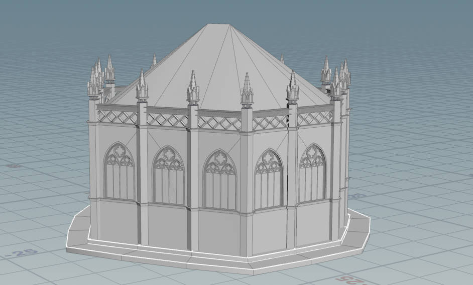
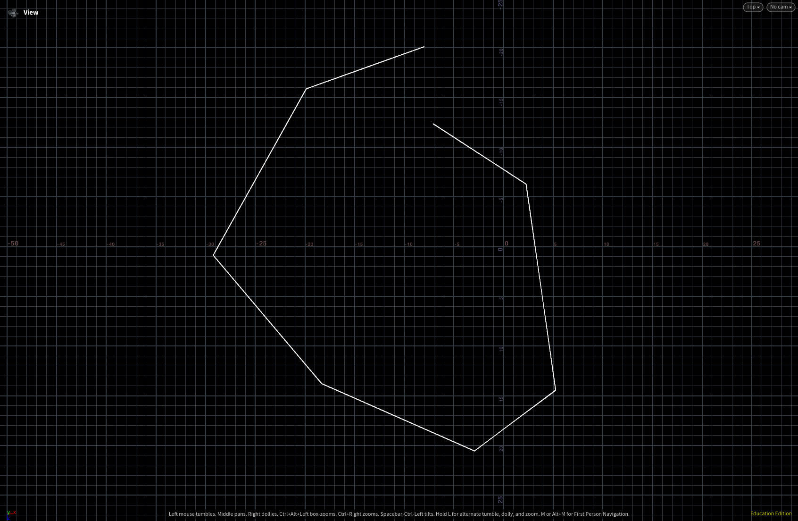
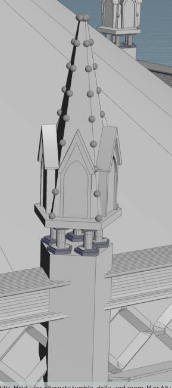
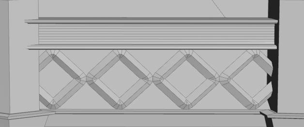
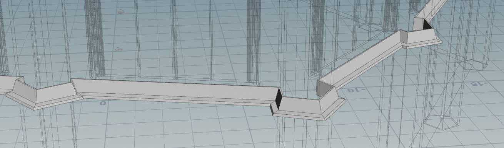
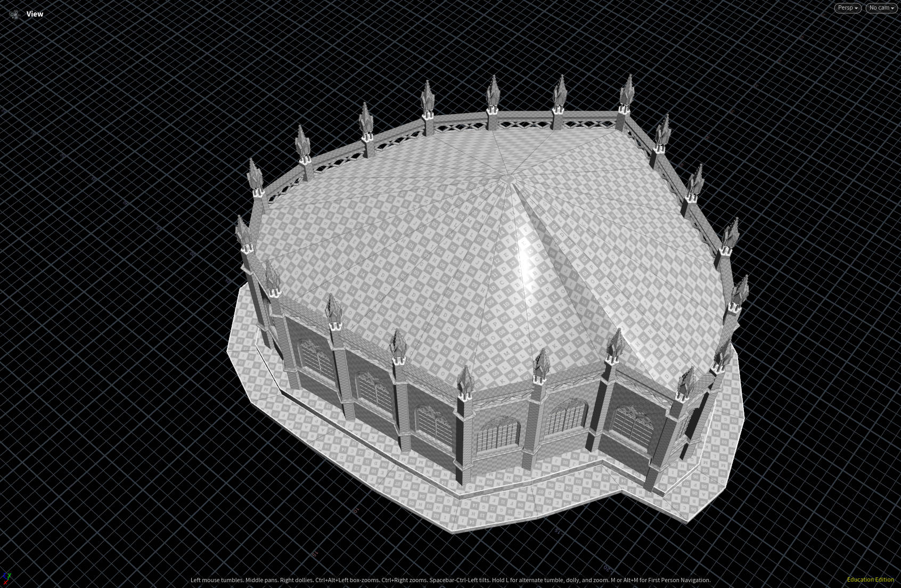
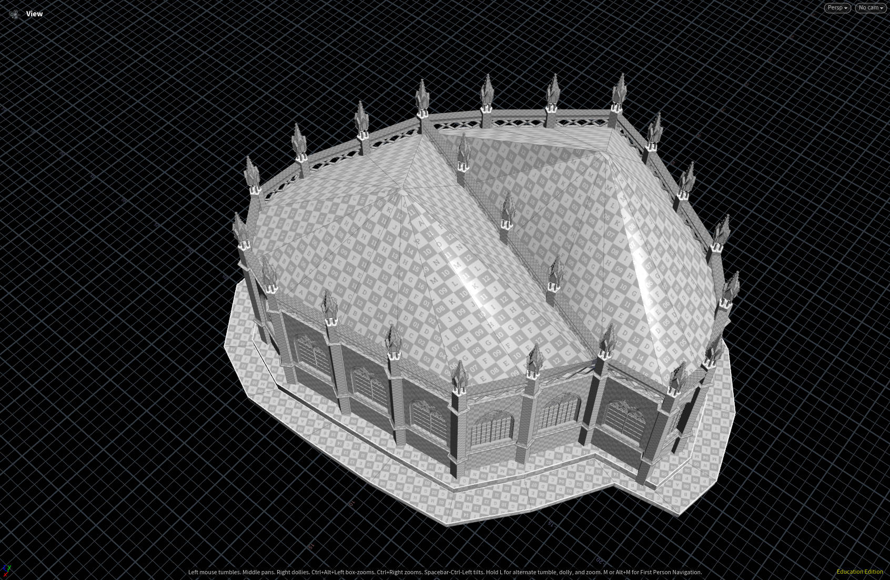
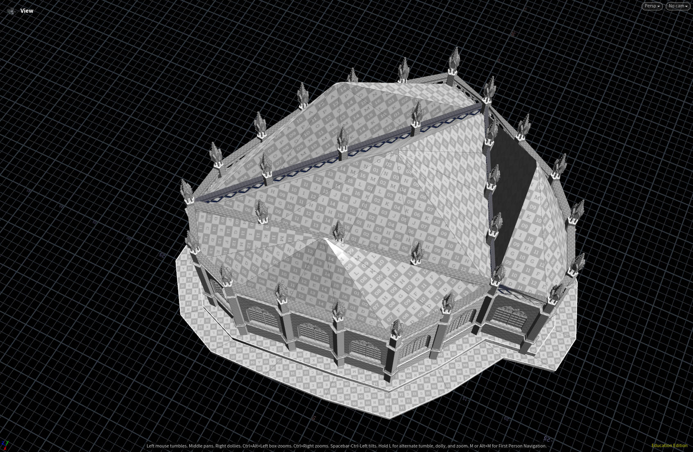
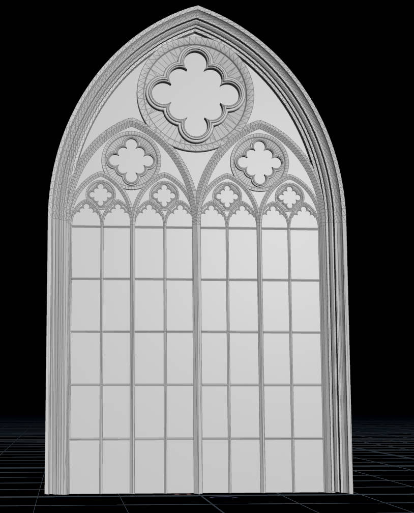
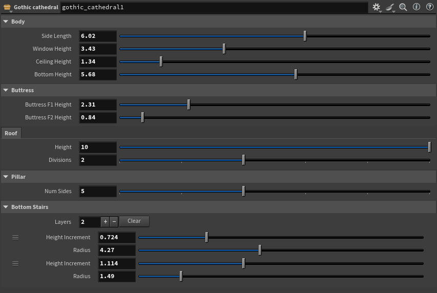

# Design Doc

## Goal
I want to continue detailing my gothic building, and create a cool interior environment for it.

## Inspiration/References:

## Specifications:
Some features I would like to recreate from the concept art:
- Procedural Staircase
- Vegetation (flowers, veins)
- butterfly flocking animation (if I have time)
- lighting scenario
- Book shelves
- (maybe) character statues
I also want to add in an idea I had from before. The building will be in 2 parts. Bottom floor is going to be bookshelves underneath the staircase. Then above it are the pretty windows.

## Techniques:
- Lot of procedural modeling
- curve based vegetation tool
- procedural flocking animation

## Design:
Seems quite straight forward so I don't think there's a need for diagrams.

# Milestone 1 & 2

### Overview

### Converted from Regular Polygon Based -> Arbitrary Curve Based

### Pinnacle

Automatically adapt to the polygon shape of the pillar

### Fence

### Border Decoration

Automatically adapt to the shape of the building, with custom curve profile.

# Final Submission

### Final Render

Rendered in UE5, used existing materials and foliages, but I compiled the landscape and did the lighting myself.

### Divided Roof

### Window Decoration

### Update Parameter Interface

### Post mortem

I was actually really far away from what I wanted to achieve at first, the complexity of the building just made me work really slow. Even though I feel like I've spent decent amount of hours into working on this in the last milestonie but the difference in the overall look is just really little.

Also I wanted to get Houdini Engine in Unreal working so the parameters could be adjusted realtime, however, Houdini Engine turned out to be really buggy and slow that the geometry would be broken and iteration speed would be even slower compared to just simply importing and almebic file.

